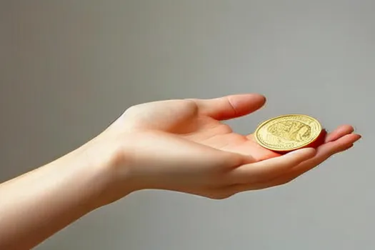
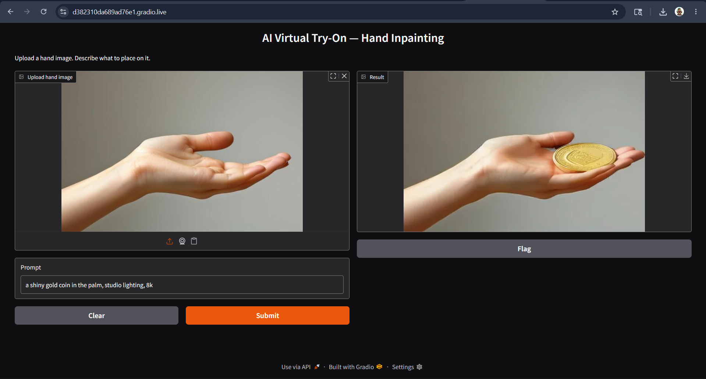

# AI Virtual Try-On — Hand Inpainting Pipeline

Detects hand landmarks via MediaPipe, generates a spatial mask using 
OpenCV convex hull, and inpaints the masked region using Stable Diffusion 
via Hugging Face Diffusers.

## Pipeline
Input Image → EXIF correction → MediaPipe landmark detection →
Palm-aware convex hull masking → SD inpainting (512×512, fp16) →
Output

## Results
| Prompt | Output |
|--------|--------|
| gold coin in palm |  |
| iron man arc reactor |  |
| celtic tattoo |  |

## Gradio Demo

## Stack
Python · PyTorch · Hugging Face Diffusers · MediaPipe · OpenCV · PIL · Gradio

## Run it
Open `virtual_tryon.ipynb` in Google Colab or for quick reference Open `https://nbviewer.org/github/Praj-maghiman/ai-virtual-tryon/blob/main/virtual_tryon.ipynb`.  
Runtime → Change runtime type → T4 GPU  
Run all cells.

## Hardware note
Tested on Colab T4 (fp16, ~45s per inference).  
CUDA-compatible locally: set `device="cuda"`, `torch_dtype=torch.float16`.  
OpenVINO/XPU optimization: planned next step for edge deployment.
